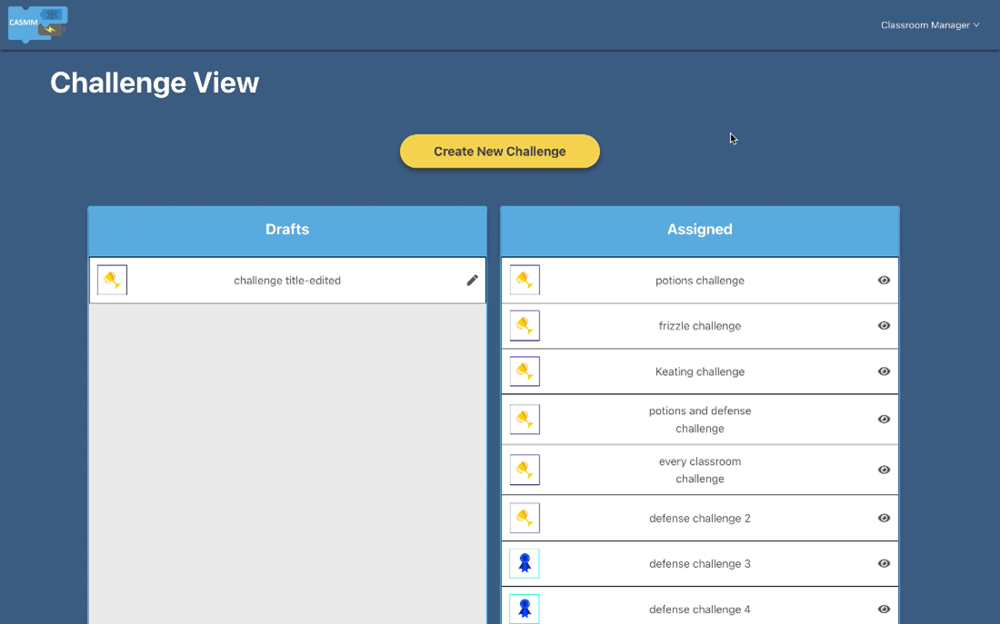
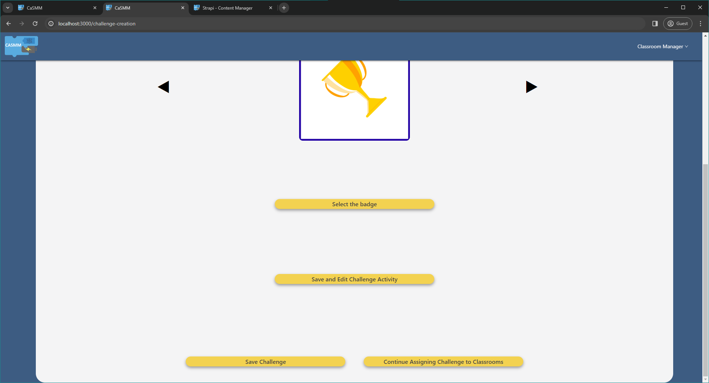
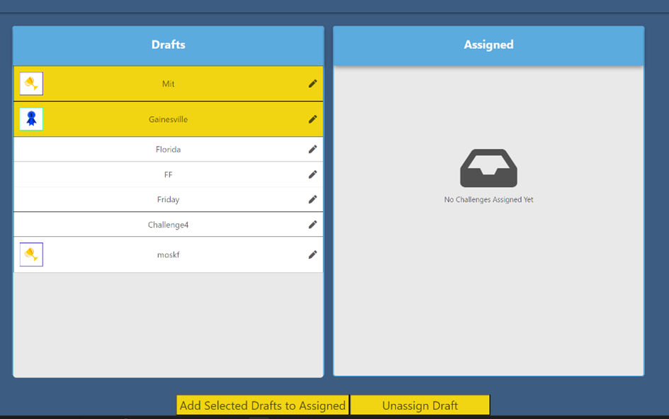
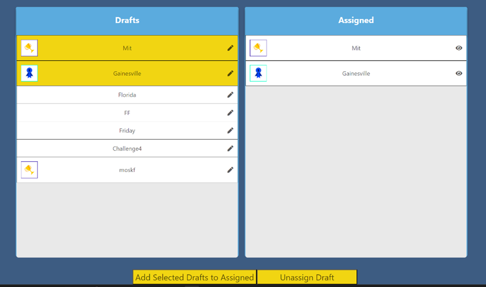
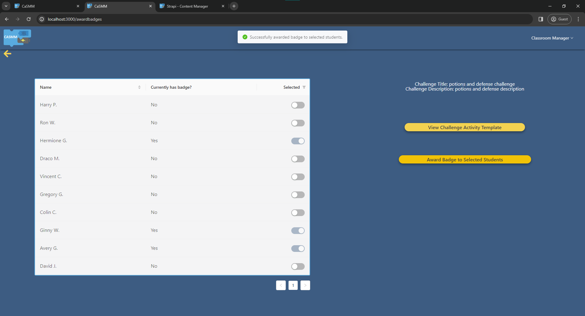
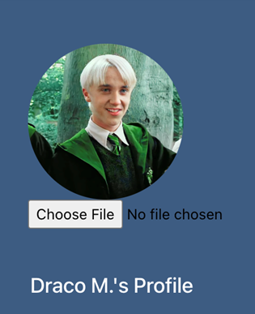
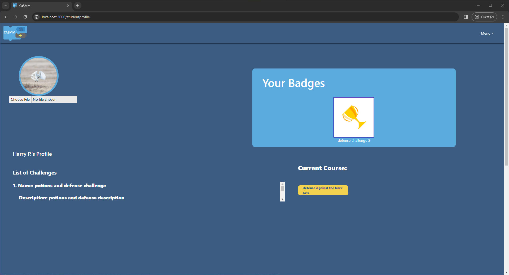
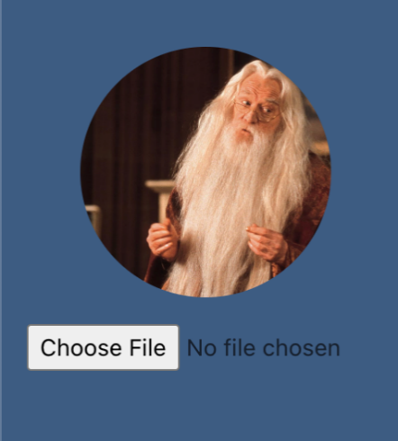
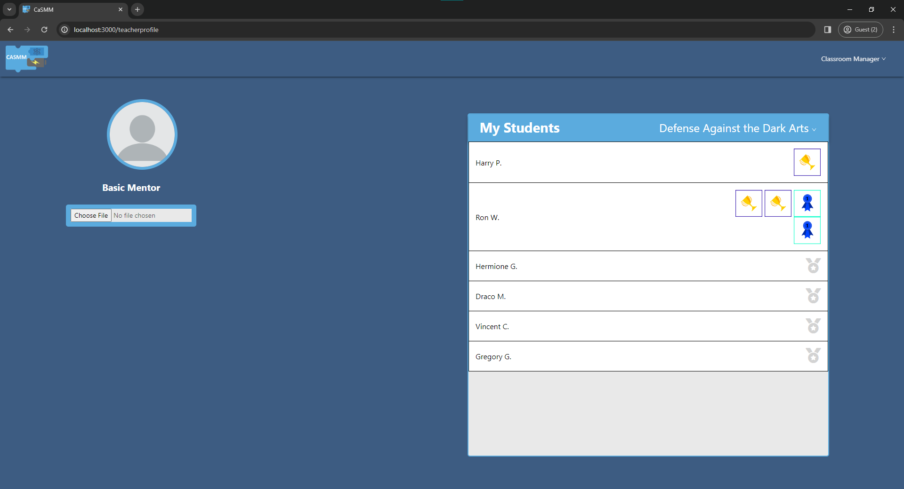

# CaSMM

> Computation and Science Modeling through Making

Cloud-based programming interface

 

## Updates by Sapphire 2a

### Features Implemented

#### Challenge View Page

Teacher can navigate to a challenge view page via the navigation bar, and it serves as a launching point to create, save, and edit challenges as well as assign badges. There are two categories of challenges displayed in separate lists, drafts which can be edited and assigned challenges where teachers can view and make associated badge assignments. The teacher can click on a button to navigate to create a challenge, and when they navigate back to the challenge view page, the saved challenge will be reflected in the drafts list. Clicking on the pencil icon will allow the user to navigate to the create challenge page where they can change its existing details. This change will also show in the challenge view page. Once the challenge is assigned to classrooms, it will be shown in the assigned list where the teacher can click on the eye icon to navigate to the assign badges page.

#### Challenge Creation Page

On the challenge creation page, teachers can create or update an existing challenge assignment. They can associate a given badge icon and activity template with a challenge. There is also a button to continue assigning challenges to classrooms. Since this functionality is not completed, clicking this button will show an error message to the user that the functionality is not available yet.

#### Assign Challenges

Creating a challenge has it stored and ready to be assigned. From this view, the teacher can assign the challenges to all current classrooms (specific classroom functionality was not completed). Assigning simply copies the existing drafts into assigned which can be viewed by a student. This means that it saves the challenge on the drafts even when publishing to students for convenience and storing purposes. Deleting challenges from drafts was discussed and thought of and was designated for a possible later sprint. Additional functionality came with the ability to unassign challenges. If an error in the challenge creation was retroactively discovered, a teacher could unassign the challenge from students. This does entail progress lost if a student worked on the challenge in between creation and deletion. Unfortunately, there were some backend issues, and the functionality is not 100% complete. Additionally, the initial version mistakenly updates the frontend of the student profile to work, whereas the student profile would have automatically updated if the challenge were properly assigned to that student’s classroom in the backend.  The following displays the following displays the teacher assign functionality.

These images show the teacher’s perspective of assigning. Note that this challenge view page does not look the same as the one from above because the branch containing this feature was not merged in with the overall team code.

#### View Challenge Details and Award Badges to Students

After having assigned a challenge to a classroom, the challenge will appear in the list of assigned challenges in the challenge view page. From here, a teacher can click on an individual challenge to navigate to a page where they can view the details of that challenge and award the badge associated with that challenge to selected students. The page also has a button to navigate to the activity template associated with the challenge, so the teacher may edit the activity template if needed.

#### Student Profile

Each student has a profile that they can navigate to. On this page, each student has a profile picture (default one given if none has been uploaded), list of challenges assigned to them, and a list of badges they have earned. Shown below is an example of the student's profile picture.

When a student completes a challenge, that challenge will disappear from the list of challenges assigned to them. Also, on the top right of the student profile, a widget displays the icons and titles of the challenges that the student has successfully completed. If the student currently has no badges, the widget instead displays a message that the student may complete challenges to receive badges.

#### Teacher Profile

On the teacher profile page, each teacher has a profile picture and a list of students in each of their classes. Shown below is an example of the teacher profile picture.

The list of students, located at the right of the page, also displays the badges that have been awarded to each student. Additionally, the teacher can filter this table by classrooms to view only students from one classroom at a time.

 

### Running the Project

The majority of our integrated code is found on the branch [integrated_team_code](https://github.com/CEN-Final-Project-Group-2a/sapphire-project16-2a/tree/integrated_team_code/server). All of our implemented features are here, with the exception of the code for teachers to assign challenges to classrooms, which is found in the branch [update_teacher_assign](https://github.com/CEN-Final-Project-Group-2a/sapphire-project16-2a/tree/update_teacher_assign). This branch has not yet been merged with everything else because the challenge assignment feature is not yet fully functional.

To deploy our existing project code, pick which branch you want to use, and use the same deployment strategy as described in the rest of the pre-existing documentation for this project. All the database configuration changes we made should be updated in the appropriate files in the [server](/server#server) subdirectory and will be handled automatically by Strapi. The database data changes will be handled automatically by the Docker compose scripts and the updated database dump file [development_db.dump](/scripts/development_db.dump#development_db.dump). Additionally, since there is currently no way in the frontend to assign challenges to classrooms within the [integrated_team_code](https://github.com/CEN-Final-Project-Group-2a/sapphire-project16-2a/tree/integrated_team_code/server) branch, this action can currently be simulated by visiting the Strapi administrator page and manually adding a classroom to a challenge in the database.

As a note, our updated development database dump file [development_db.dump](/scripts/development_db.dump#development_db.dump) has new database example data in it that we have used to test our features. Most of these are example challenge entities. During testing of the integrated code branch, challenge entities were created with a given mentor’s account and then associated with subsets of the list of classrooms associated with that mentor. However, the current implementation to assign challenges only allows mentors to assign challenges to all their classrooms at once. To fix this mismatch of feature and database entries, the dump file for the [update_teacher_assign](https://github.com/CEN-Final-Project-Group-2a/sapphire-project16-2a/tree/update_teacher_assign) code branch represents a database state where all the challenges assigned to only a subset of classrooms have been removed. As a result, the database dump file for this branch and for the integrated team code branch do not currently match.

 

### Outstanding Work

As described above, the functionality for teachers to assign challenges to classrooms is not yet completed and is necessary to complete to allow for the full challenge workflow, where teachers will create challenges, assign them to classrooms, and award badges to students who have successfully completed those challenges. In particular, this feature looks mostly complete from a frontend perspective but needs to be set up to update the database when challenges are assigned to classrooms. Also, there is a way to de-assign challenges, but the teacher can only de-assign all of them at once rather than de-assigning a selection of them. It may be helpful to create a way for teachers to select which challenges they want to de-assign.

Additionally, the student profiles currently only work properly when one student is logged in.  In future, we would want a way to select which student profile to navigate to given the list of logged-in students.

Currently, the student sees the list of challenges assigned to them, but they still need a way of accessing the activity/Blockly page associated with the challenge.

In order to implement updating the profile picture for a student, the student role was temporarily given database permission to update any other student given their id. This presents a risk of a student updating the information for another student, so a custom database request route with proper authentication might need to be implemented in the future.

The challenge view page will display a "There are no challenges drafted/assigned yet" icon while waiting to retrieve the list of challenges associated with a given mentor in the database. This could be confusing to the user, so it could be better to have a loading icon display while waiting for the database request to finish.

Finally, the challenge details/badge awarding page does not allow teachers to revoke badges from students. Given it could be a source of frustration for a teacher to accidentally permanently award a badge to a student, it could be helpful to present the teacher with a confirmation modal/pop-up before going through with the action.

 

## Application

### `client` 
[client](/client#client) is the frontend of the application. It is powered by [React](https://reactjs.org/) and [Blockly](https://developers.google.com/blockly).

### `server`

[server](/server#server) is the web server and application server. It is powered by [Node](https://nodejs.org/en/) and [Strapi](https://docs-v3.strapi.io/developer-docs/latest/getting-started/introduction.html).

### `compile`

  [compile](/compile#compile) is an arduino compiler service. It is an unofficial fork of [Chromeduino](https://github.com/spaceneedle/Chromeduino).

 

## Environments

> The project is divided into three conceptual environments.

### Development
#### Structure

The development environment is composed of five servers. The first one is run with the [Create React App](https://create-react-app.dev/docs/getting-started/) dev server. The later four are containerized with docker and run with [docker compose](https://docs.docker.com/compose/).

* `casmm-client-dev` - localhost:3000

* `casmm-server-dev` - localhost:1337/admin

* `casmm-compile-dev` 

* `casmm-db-dev` - localhost:5432

  > The first time the db is started, the [init_db.sh](/scripts/init_db.sh) script will run and seed the database with an environment specific dump. Read about Postgres initialization scripts [here](https://github.com/docker-library/docs/blob/master/postgres/README.md#initialization-scripts). To see how to create this dump, look [here](https://github.com/DavidMagda/CaSMM_fork_2023/blob/develop/scripts/readme.md).

* `casmm-compile_queue-dev`

#### Running

`casmm-client-dev`

1. Follow the [client](/client#setup) setup
2. Run `yarn start` from `/client`

`casmm-server-dev`, `casmm-compile-dev`, `casmm-db-dev`, and `casmm-compile_queue-dev`

1. Install [docker](https://docs.docker.com/get-docker/)

2. Run `docker compose up` from `/`

   > Grant permission to the **scripts** and **server** directories if you are prompted
   

### Staging

#### Structure

The staging environment is a Heroku app. It is composed of a web dyno, compile dyno, Heroku Postgres add-on, and Heroku Redis add-on.

* `casmm-staging` - [casmm-staging.herokuapp.com](https://casmm-staging.herokuapp.com/)
  * The web dyno runs `server`
  * The compile dyno runs `compile`

#### Running

`casmm-staging` is automatically built from the latest commits to branches matching `release/v[0-9].[0-9]`. Heroku runs the container orchestration from there.

### Production

#### Structure

The production environment is a Heroku app. It is composed of a web dyno, compile dyno, Heroku Postgres add-on, and Heroku Redis add-on.

* `casmm` - [www.casmm.org](https://www.casmm.org/)
  * The web dyno runs `server`
  * The compile dyno runs `compile`

#### Running

`casmm` is automatically built from the latest commits to `master`. Heroku runs the container orchestration from there.

 

## Maintenance

All three components of the application have their own dependencies managed in their respective `package.json` files. Run `npm outdated` in each folder to see what packages have new releases. Before updating a package (especially new major versions), ensure that there are no breaking changes. Avoid updating all of the packages at once by running `npm update` because it could lead to breaking changes. 

### Strapi

This is by far the largest and most important dependency we have. Staying up to date with its [releases](https://github.com/strapi/strapi/releases) is important for bug/security fixes and new features. When it comes to actually upgrading Strapi make sure to follow the [migration guides](https://docs-v3.strapi.io/developer-docs/latest/update-migration-guides/migration-guides.html#v3-guides)!

 

## CI/CD

All of the deployments and releases are handled automatically with [GitHub Actions](https://docs.github.com/en/actions). The workflows implement custom [Actions](https://github.com/STEM-C/CaSMM/actions) that live in the [auto](https://github.com/STEM-C/auto) repo.

 

## Contributing

### Git Flow 

> We will follow this git flow for the most part — instead of individual release branches, we will have one to streamline staging deployment 

### Branches

#### Protected

> Locked for direct commits — all commits must be made from a non-protected branch and submitted via a pull request with one approving review

- **master** - Production application

#### Non-protected

> Commits can be made directly to the branch

- **release** - Staging application
- **develop** - Working version of the application
- **feature/<`scaffold`>-<`feature-name`>** - Based off of develop
  - ex. **feature/cms-strapi**
- **hotfix/<`scaffold`>-<`fix-name`>** - Based off of master
  - ex. **hotfix/client-cors**

### Pull Requests

Before submitting a pull request, rebase the feature branch into the target branch to resolve any merge conflicts.

- PRs to **master** should squash and merge
- PRs to all other branches should create a merge commit
